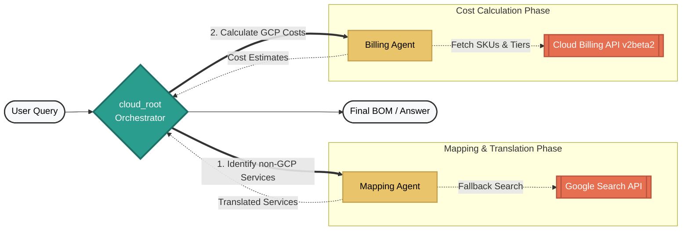

# 🛠️ GCP Blueprint AI

**GCP Blueprint AI** is a conversational analysis and cost estimation tool designed to simplify cloud architectural planning. Whether you are starting a new project natively on Google Cloud or translating an existing infrastructure from AWS or Azure, it acts as a specialized assistant—instantly mapping components and generating real-time, precision-grade Bill of Materials (BOM) using live pricing data.

## ✨ Key Capabilities

- **🎯 1:1 Cloud Service Mapping**: Accurately translate AWS and Azure services into their direct GCP counterparts using expert-level architectural logic.
- **💰 Native GCP Cost Exploration**: Quickly find pricing for any GCP service (e.g., "What does a Cloud Run instance cost in us-east1?") without needing a translation step.
- **👁️ Multimodal Inventory Analysis**: Upload a screenshot of your cloud console or architecture diagram; the system identifies the components and provides their GCP equivalents and costs.
- **📊 Live Cost Estimation**: Leverages the official **Cloud Billing Catalog v2beta2 API** to find real-time, tiered pricing for specific GCP SKUs and regions.
- **🤖 Specialized Orchestration**: A hierarchical agent tree that routes your requests between the **Mapping Agent** (for translation) and the **Billing Agent** (for cost lookups).
- **📋 BOM Generation**: Compiles all identified services and their estimated costs into a structured Bill of Materials for quick architectural review.

---

## Architecture Structure (Hierarchical Agent Tree)

This application is built as a hierarchy to segment analytical tasks from search APIs and calculations.



1. **`cloud_root`**: The starting point. Interprets what the user is asking and routes them to subagents if needed.
2. **`mapping_agent`**: Responsible for identifying non-GCP resources (AWS/Azure) either via text or architecture diagram image vision, and mapping them to their GCP equivalents. Uses built-in architect intelligence or fallback web-search.
3. **`billing_agent`**: Looks up prices for specific GCP services dynamically to generate a precise BOM using the Cloud Billing catalog v2beta2 API.

---

## Technical Prerequisites
- A Google Cloud Project
- Python 3.10+
- Service Account Credentials JSON having `Vertex AI Admin` and `Cloud Billing API` read access.
- `uv` Package Manager installed system-wide.

## Installation Guide (using `uv`)

Development is built around `uv` for ultra-fast, reproducible python environments.

1. **Clone the repository and enter directory**:
    ```bash
    git clone https://github.com/RahulRaj/newGcal.git
    cd newGcal
    ```

2. **Sync the Environment**:
    Use `uv` to parse `pyproject.toml` and `uv.lock` to set up your `.venv`.
    ```bash
    uv sync
    ```

3. **Configure Environment Variables**:
    Create `.env` at the project root and add your details:
    ```ini
    PROJECT_ID=your-google-cloud-project-id
    LOCATION=us-central1
    GOOGLE_APPLICATION_CREDENTIALS=/path/to/your/service-account.json
    ```

4. **Launch the ADK Server via `uv`**:
    Start the development Web UI to interact with your agents.
    ```bash
    uv run google-adk dev
    ```

## Usage

1. Open the UI at `http://localhost:8080`
2. Create a new session.
3. Chat with the root orchestrator:
   - *"Show me the monthly cost of 3 Compute Engine N2-standard-4 instances in us-central1."*
   - *"I want to move an Azure Function and Azure SQL DB to GCP, what are the costs?"*
   - *"Provide a BOM for 3 instances of a standard GKE node pool in europe-west1."*
   - Or upload an image of a cloud architecture to translate.

---

## 🚀 Future Roadmap

I am actively working on expanding **GCP Blueprint AI** with powerful new capabilities:
- **🎨 Architecture Generation Agent**: A new specialized agent that can generate complete GCP architecture diagrams from scratch based on a text description.
- **🔄 Visual Translation**: An automated pipeline to translate existing AWS/Azure architecture diagrams directly into visual GCP blueprints.
- **📊 Extended Analytics**: Support for more complex usage patterns and multi-cloud optimization strategies.
